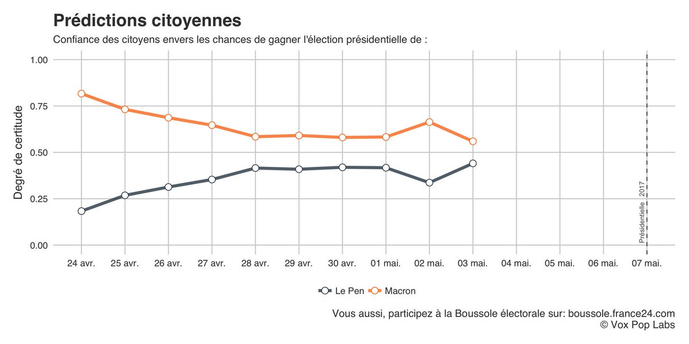

# Peut-on prédire le résultat des élections avec Twitter ? 

L'**objectif** de ce mini-projet est de developper, de manière très incrémentale, un système d'analyse de tweets comme prédicteur de résultats d'élections.

Au travers de ce projet, vous decouvrirez l'écosystème python pour travailler avec Twitter et faire de l'analyse de données textuelles mais aussi plusieurs principes du mouvement dit du [*Software Craftmanship*](https://www.octo.com/fr/publications/20-culture-code). 

## Organisation du mini-projet

Ce mini-projet est découpé en plusieurs objectifs, eux-même découpés en  **sprints** et **fonctionnalités**. La notion de sprint fait référence à la [méthode agile](https://fr.wikipedia.org/wiki/M%C3%A9thode_agile). Un sprint correspond à un intervalle de temps pendant lequel l’équipe projet va compléter un certain nombre de tâches.

Ce travail de découpage a été fait pour vous mais c'est une des premières étapes à faire pour tout projet de developpement logiciel, au moins de manière macroscopique. Pensez-y la semaine prochaine !

### **Objectif 1 (MVP): Notre premier analyseur de Tweets** (JOUR 1 et JOUR 2)

L'objectif des deux premières journées est de constuire et d'implémenter une version simple de l'outil d'analyse de tweets que l'on pourrait qualifier de **[MVP (Minimum Viable product)](https://medium.com/creative-wallonia-engine/un-mvp-nest-pas-une-version-simplifi%C3%A9e-de-votre-produit-89017ac748b0)**. 

Ce concept de MVP a été introduit par Eric Ries, l'auteur de [The Lean Startup](http://theleanstartup.com/), une approche spécifique du démarrage d'une activité économique et du lancement d'un produit. La figure ci-dessous permet de bien expliquer ce concept.

 + **Sprint 0** :
	 + [Installation du socle technique.](./Sprint0Install.md)
	 + [Analyse des besoins.](./Sprint0Analyse.md) 
	 + [Refexion autour de la conception.](./Sprint0Conception.md)

 + **Sprint 1 : Collecte des données avec [Tweepy](http://www.tweepy.org/)**
 
 	+ [**Fonctionnalité 1** : Prise en main de tweepy : se connecter à l'API Twitter.](./S1_twitterconnect.md)
 	+ [**Fonctionnalité 2** : Collecter des tweets avec Tweepy - Prise en main.](./S1_twittercollect.md)
 	+ [**Fonctionnalité 3** : Collecter des tweets relatifs à une élection.](./S1_twittercollectquery.md)
 	+ [**Fonctionnalité 4** : Stocker les tweets.](./S1_twitterstorage.md)
 		
 + **Sprint 2** : **Traitement et Analyse des tweets**
 	+ [**Fonctionnalité 5** : Quelques informations statistiques.](./S2_Pretraitement.md)
 	+ [**Fonctionnalité 6** : Visualisation de l'évolution d'une caractéristique.](./S2_TweetTimeSeries.md)
 		
 + **Sprint 3** : **Ajout de l'analyse de l'opinion avec [Textblob](https://textblob.readthedocs.io/en/dev/)**
 	+ [**Fonctionnalité 8** : Prise en main de Textblob](./S3_textblob.md)
 	+ [**Fonctionnalité 9** : Prise en compte de l'opinion](./S3_opinion.md)

 + **Sprint 4** : **Visualisation simple de l'analyse avec [seaborn](https://seaborn.pydata.org/)**	

 	+ [**Fonctionnalité 10** : Afficher le résultat de l'analyse.](./S4_displayresult.md)
 	

### Objectif 2 : Visualisation plus avancée des résultats de l'analyse (Amélioration du MVP) (JOUR 3)
**(A venir)**

+  **Sprint 5** : **Une application de visualisation de l'analyse avec [Dash](https://plot.ly/)**
	+ [**Fonctionnalité 11** : Votre première application avec Dash](./S5_affichagegrille.md) 
	+ [**Fonctionnalité 12** : L'application Tweet Predictor](./S5_tweetpredictor.md) 

+  **Sprint 6** : **Quel vocabulaire avec [WordCloud](https://github.com/amueller/word_cloud)!** 

	+ [**Fonctionnalité 13** : Prise en main de WordCloud](./S6_wordcloud.md)
	+ [**Fonctionnalité 14** : WordCloud sur votre ensemble de twwetss](./2048_S6_configgrille.md)

### Objectif 3 : Ajout de l'analyse des sentiments par apprentissage (JOUR 4)

**(A venir)**

